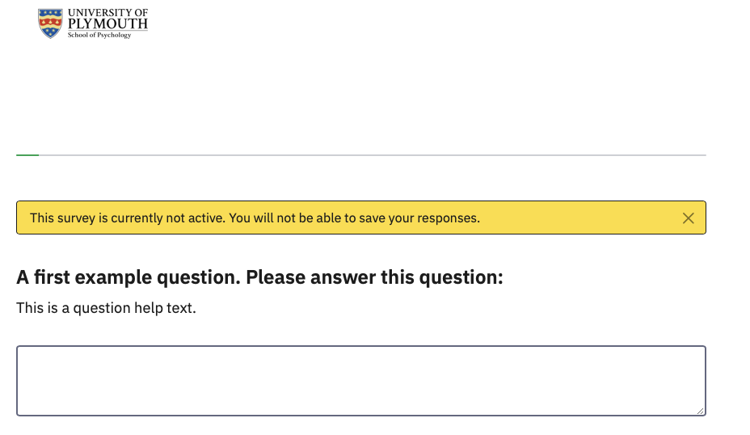

# First steps

## Getting an account and logging in

Whenever you are collecting data online, you need to make sure that the
system you use is GDPR compliant. All survey respondents should be sure
that their responses are anonymous and confidential, while allowing for
sharing of non-identifying data to comply with open science practices.

**JISC OS** is a low-cost basic system used widely by UK higher
education institutions, and is subscribed to by the University. You can
obtain an account from TIS. It is suitable for simple straight-through
surveys of undergraduates, with no need for randomisation or pretty
layouts. If you want speed and simplicity, use JISC OS.

**Limesurvey** is an open source platform, and offers more professional
looking surveys, with greater functionality, but it is correspondingly
complicated to use. The school has its own implementation, running on
our own servers, administered by the Technical Office. If you need
anything more than a simple fixed set of questions, use Limesurvey.

### How to get an Account and Login

In a browser, visit <https://psysurvey.plymouth.ac.uk>

Academic staff will have accounts created for them, but students can
create their own.

To create your account, click the ‘Forgot your password?’ link and use
your UoP email address and password.

If asked for your username, use your email address.

</th>

{width="50%"}

You will be sent an email with a link to create your password. Once you
have created a valid password, you can log in.

When you first log in, you will see this screen, allowing you to List
the surveys you have created. If you click the button
 you will (of course) see no surveys yet. You can
access this list at any time by clicking Surveys in the top menu bar.
{width="50%"}

NB: If you are a member of academic staff you will be able to see all
existing surveys.

## Create a new survey

Create a new survey using the purple Create new survey button at the top
of the window

Give your survey a title (you can edit this later) and then click Create
survey

{width="50%"}

Your survey will look like this – Limesurvey automatically creates a
Question for you (called ‘Q00’) and puts it into a Question Group called
‘My first question group’. Putting questions in groups lets you organise
your survey, and is an essential part of randomisation or presenting
questions in a set order. Before editing this question, notice the
details on this screen:

At the top left is the name of your survey, as a link of ‘breadcrumbs’
which you can use to navigate back up to the list of all your surveys,
or to other surveys.

Below that are two tabs – the overall **Settings** for your survey and
the **Structure** which lists the actual questions. At the moment, you
cannot see your Q00 in this list, but if you click the little triangle
in the group name, it will be shown. Hiding questions until you need to
see them helps keep the view manageable.

The Question Summary gives an overview of the Question text and some
settings which we will come onto later. At the top are some buttons that
let you preview how the question or group of questions or the whole
survey will appear on screen. If you click **Preview Survey**, you
should see this **welcome screen**, and then when you click **Next**,
the question:

{width="50%"}

CLicking the green **Next** button takes you to the first question:

{width="50%"}

By default all surveys on **psysurvey** include the school logo, as
required by the Ethical Committee.

Under that is a progress bar, which again is on by default but which can
be turned off. The yellow box appears to let you know that this is a
preview and your entry will not be saved anywhere.

Below that is your question. You can also turn off the welcome screen –
everything in **Limesurvey** can be controlled.

## Structuring your questionnaire

Before you plough into creating questions, think about the basic
sections that every survey will need. Don’t build your survey as one
huge long screen full of questions. Use separate screens with a few
related questions on each one.

The horizontal arrows in this figure show how the survey continues when
the participant clicks ‘Next’ on each page. The arcs show how the survey
can skip pages using **branching.** You can also use branching to
present some sections depending upon answers given earlier. You can also
include answers given in one question in subsequent questions using
‘**piping**’. Branching and Piping are described in later sections.

The first page of any survey must be an information page that explains
what the survey is about, why you are asking people to complete it, how
long it will take, and what it involves. You will have to provide all of
this information to get ethical approval. This information allows people
to give informed consent.

If people give consent, then the next page will probably need to collect
demographic information: you should only collect information that you
will need to report, and which is relevant to your survey.
Conventionally, sex and age are always reported, but if your survey is
on a particular topic you may need other personal information, such as
sexual orientation or height and weight. At the end of the survey, there
should be a page that thanks them and gives debriefing information, as
appropriate, perhaps explaining any hypotheses that you are testing and
other information that could not be provided in the consenting page at
the start.

If the respondent does not give consent, then they should be thanked
politely, but they should not receive the same debrief. In Limesurvey,
you can make questions only appear if an early question has been
answered in a certain way – so only if they have given consent, for
example. Rather than jumping over questions, they are just not shown.

At the end of a survey, you can redirect the participant to another
website (e.g., to another survey, a website or online experiment, or
back to SONA to credit their account with a participation point).

For example, you can recruit participants for an online experiment on
SONA, and send them to Limesurvey for the consent form and to collect
demographic data, before redirecting them to your OpenSesame experiment
on JATOS. At the end the experiment can send them to a second Limesurvey
survey for the debrief, and perhaps some more scales, and a redirect to
SONA to award their point. Each time the participant goes to a new
website, their participant number is passed along and recorded in the
data for each site. This is described in the final section of this
guide.

