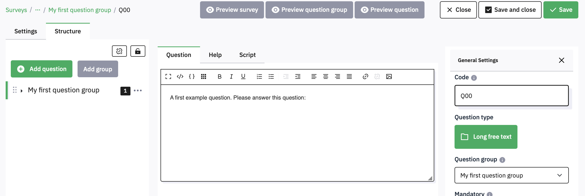
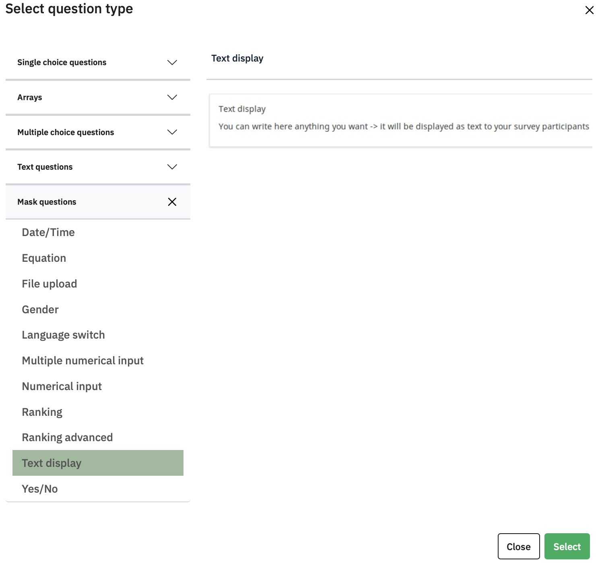
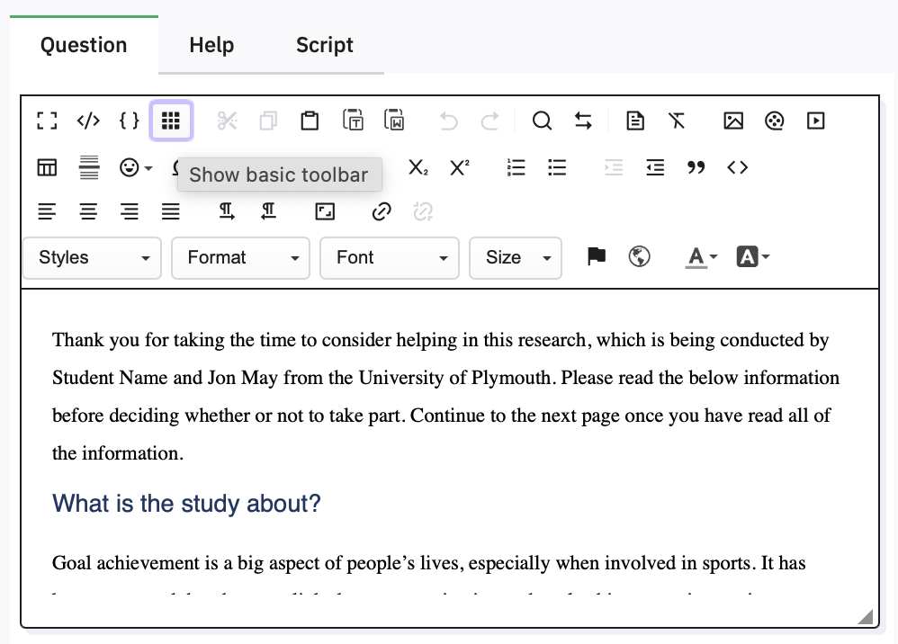
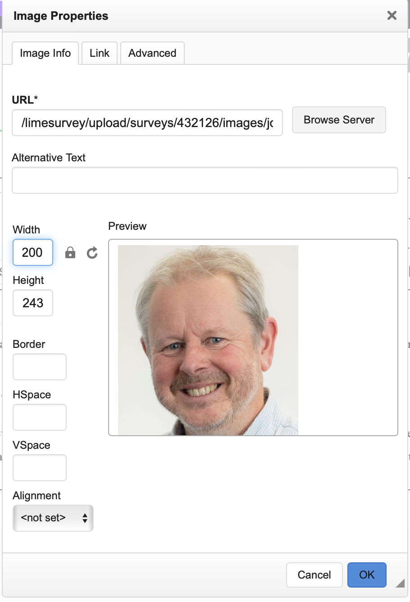
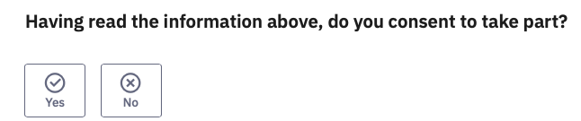
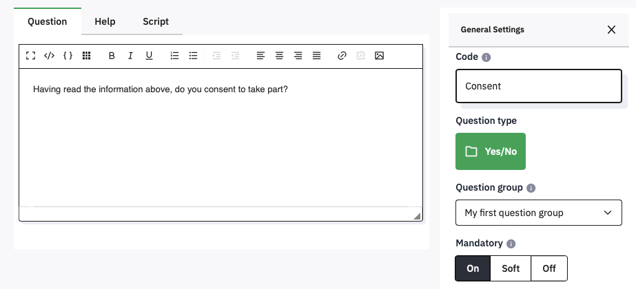

# Add a text-only Information page and Consent question

Every study should start with an information page, where participants
can give informed consent, or opt out.

Q00 has been created as a **long free text** entry question, but you can
change it to just display text, and then follow it with a simple Yes/No
question. Click the green **Edit** button to change these details. When
you do , you will see this:

 

## Creating a text only question

First, edit the **Code** box to change the name of the question from Q00
to InfoText. Then click the green **Long free text** under **Question
Type**, and from the pop up under **Mask Questions** select **Text
Display** and then click the **Select** button.

 

This popup shows you the large range of different question types you can choose between, with whatever you have chosen previewed on the right.

In Appendix 1 is an example of some text you might want to include in a
structured consent page. You can also find a copy of this alongside this
guide on the DLE

Paste the text into the box where it says ‘A first example question.
Please answer this question’. You can use the icons at the top of the
box to format the text. If you click the little grid icon you’ll see the
full range of formatting available.

 

 

Remember to click the  button whenever you have
made changes. Limesurvey does not Autosave, so if you mess things up,
you can Close and reopen to revert to your previous content.

## Previewing

Previewing is helpful to spot any mistakes you have made in
understanding the formatting, so you should do it frequently, and
especially before duplicating questions or sections of your survey (to
avoid having to correct all of the copies!)

## Adding Images or Movies
If you ever need to add an image or movie to a question (or to Text)
then there are three buttons on the toolbar that allow you to do this.
They either need to be stored elsewhere on the internet (so you can
provide a URL) or you can upload them to psyserver. For example, adding
a simple image can be done by clicking the
 button. In the dialog that
appears, click **Browse Server** to get the
 option and find a file on
your computer to upload:

{width=50%}

{width=50%}

To select the image you have uploaded, double-click it. Depending on its
size, it might not all show in the preview box of the Image dialog, so
you can enter a sensible display width or height (the other will be
calculated):

{width=50%}

When you have added a picture to the top of your Information Text,
click the green **Save** button and then
**preview** **question**.

## Adding Yes/No Questions

At the bottom of the consent page, you will need to add a single
question that allows the participant to give their informed consent, or
not:

 

To add this new question, click the  button at the left. You can
then select the question type – from **Mask**, select **Yes/No.** In
**Code**, change its name to Consent, set **Mandatory** to **On**, and
then type the Question text in the large box.

 

Click **Save and Close**, and then **Preview Question**.

## Customising the appearance of the survey

It is not necessary for participants to see the Welcome screen with the
name of your survey. To stop these being shown, click **Settings** and
then **Presentation**. Here are the current default settings (the ' mark
indicates a default setting):

{width=75%}

The top right option controls the display of the Welcome screen. To stop
the welcome screen being shown, click **Off** and then **Save.** Return
to the Structure tab to continue editing.

Another setting you may wish to change is in **General Settings.** The
Format setting controls whether every question is shown on a separate
page, or whether all the questions in a group are shown on a single
page, or whether the entire survey is shown in one long page. The
default setting is to start a new page for each group (**Group by
group**), which is most useful, but if you do want to change it, now you
know where. If you have the appropriate permissions, you can also change
the Theme of your survey, but if you do not use the default School of
Psychology theme you will have to add the logo manually.

 

