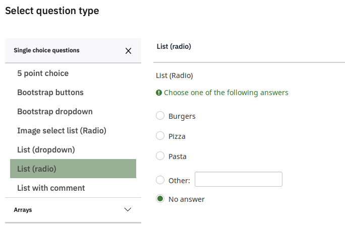
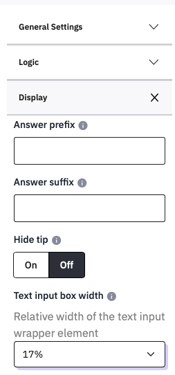

# Creating questions
## Age and Sex
After the consent page, it is common to ask for demographic variables
such as age and sex. It is better to collect these at the start of the
survey, and not at the end, in case people drop out during the survey.
You can run statistical tests for selective drop out by sex or age
(etc.) if you collect the information at the start of the survey.

## Make a new Group of questions

To show these on a new page, click **Add Group**, and give the Group the
**Title** Demographics. Here is no need to add a **Description**.

Click **Save**, and then **Add Question**. Name your new question Sex.

## Always Name your questions

**Naming questions is essential**. These names will be used as
the columns in your data file, and in using other survey features, so
they should be short, informative and not contain spaces or other
punctuation. If you need to use more than one word, or need to add
numbers, then use an underscore e.g., ‘Scale_Before’ and ‘Scale_After’.
Using an underscore as a 'delimiter' makes it easy to preprocess the
data in statistical software such as R or Jamovi.

## Create a single choice question

When you select the **Question Type**, you will see that in **Mask**
there is a predefined **Gender** question, which you can use later if
you like, but for now please use **Single Choice Questions** and choose
**List (radio)** (radio means that it used ‘radio buttons’ which only
allow one option to be chosen, unlike checkboxes, which allow several
options to be chosen).

Make the question something like ‘What sex are you?’.

Enter the options in the **Answer options** section under the
**Question** box.

Change the text ‘Some example answer option to ‘Female’, then click the
green  and type ‘Male’.

Before continuing, change the **Code** boxes too. This is not essential,
but it is a very good thing to do because it will make your data file
more readable and makes later things easier to do as well. The shorter
your Code is while still being meaningful the better, so lets use F, M
and DNS.

What other options apart from Male and Female might you want to add?
Obviously it is possible that you might have participants who do not
want to identify themselves as either female or male, but do you want to
specify lots of possible options in this question, trying to guess their
preferred description?

Consider how you would report this in your write-up: you would probably
not want to use a lot of space on this, and would just write ‘67 female,
48 male, and two others’. You could therefore add a ‘Do not wish to say’
option.

If you want to have an Other option that allows people to type their own
response then on the right hand side, set **Other** to On. Click
**Save** and **Preview the Question:**

## Mandatory questions

Should you make this question Mandatory? Forcing a response can avoid
getting missing data if a respondent misses a question by mistake, but
it can also annoy people who don’t want to answer one item but might do
the rest of your survey, so think carefully about how essential it is to
obtain the data you are asking for and use it sparingly. In this case,
leave **Mandatory** at Off (in analysis, you can recode missing answers
as ‘Do not wish to say’)

## Asking for a number

Age is more complicated than sex. You would not want to use a question
with every possible age listed, and you need to collect more exact
details than ‘age groups’ such as ‘under 18’, ’18 to 24’, and so on or
you cannot report the mean and range.

You could ask them to type their age, but you want to make sure they
only enter a number, not text. Text entries would be very difficult to
analyse – you cannot find a mean from text.

To force people to enter a number, create a new question and select
**Mask questions, Numerical input**

Name this question Age, and then enter the question text ‘How old were
you at your last birthday (whole years)’.

While editing this question, you can change the amount of space provided for the answer from the whole width of the screen to a smaller size – in the settings on the right, click **Display**, and change the **Text input box width** to 17%.

