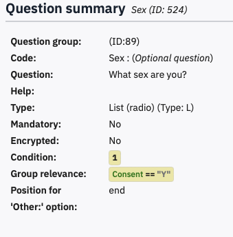

# Branch to different pages depending on participants answers

You may often want to skip a question or more depending upon a
respondent’s answers to a question. For example, if they answer No to
the consent question you need to skip the whole survey. If you have used
other survey platforms you may know this as Skip Logic or Branching.

With Limesurvey’s ability to conditionally display questions depending
upon the value of previous answers, there is no need for branching – you
just set a question or group’s condition so that it is not displayed.

Even better, you can make questions appear when another question has
been answered, as we did when we made Sex dependent upon the value of
Age that people entered.

In this respect, Limesurvey is much simpler and more flexible than other
platforms.

To demonstrate how this works, we will make people who do not consent
skip past the questions to see a Sorry message, 
and add Thank you people for people who did consent and
who have done the survey.

## Make a question group conditional

If you preview your survey, you will find that even if
you say No to the consent question, the survey carries on to ask you
your Sex and Age.

We need to set a condition for the Demographics group, and any other questions, 
so that it is
only shown when Consent has been given and the answer recorded is Y.

To do this, click the Demographics group name to see the Group Summary,
and then click **Edit**. At the bottom of the page, set the
**Condition**

You are entering some computer code that specifies the question name on
the left, and the value it has to have on the right. Be careful to get
these exactly correct – case matters. 

Also make sure to use plain straight quote marks, not &ldquo;smart&rdquo; or curly quotes.

There are two things that might seem odd here:

1)  You need two equals signs because in computer coding, two == is a
    comparator that tests whether two things have the same value, but
    one = sign is an operator that *makes* something be equal to a
    value.

2)  The buttons said Yes and No, but the value recorded is Y or N

When you click **Save and close** to return to the summary, it now shows this:

If you make mistakes, you may see this instead – the red box shows that Limesurvey does not know of a question called ‘consent’ with a little c

If you hover the mouse over the red = sign, it will tell you that you
are assigning a new value to a variable instead of comparing it. It lets
you get the value wrong though – nothing it can do about that.

When you are writing conditions, do take a moment to check this helpful
diagnostic information.

## Making an individual question conditional

Setting a Condition at the Group level means that it applies to all the
questions in that group. It is easy to change, and most surveys will not
have many Groups.

You can also set the Condition at a Question level. If you click
on Sex, to see the Question Summary, you can see that it has inherited
the Group relevance setting from the group’s Condition.
Consent is now green to show that it is a valid question name.
The Sex question’s condition is set to 1, which means ‘TRUE’ or
‘Always’ show, provided that the Group is being shown.

Edit the Sex question, and in General Settings, change the Condition
to Age >= 18

Preview the survey and give consent, and you should then see the Age
question. Enter an Age value of 18 or more, and the Sex question will
appear. Change the Age to under 18, and it will vanish. Any value you
chose for Sex will still be there – all that is changing is whether or
not the Question is displayed.

If you want a more complex condition, for example, only people between 18 and 40, then you can combine them using AND
e.g., Age>=18 AND Age<=40. Alternatively, you could say Age=18 OR Age=40 if you only want 18 and 40 year olds to answer a question. To negate a condition, put an exclamation mark before it, e.g., !(Age=18 OR Age=40) means everyone who is NOT 18 or 40.

Being able to make any question’s display conditional on other answers,
even if they are on the same screen, is a powerful feature of
Limesurvey.

## Re-ordering questions and groups

Normally, you would want a conditional question to appear *after the*
one it depends on, not *before*. You can reorder questions in the
Structure by dragging them – click the matrix of six dots to the left of
the Question name, and drag Age above Sex. Now when you preview the
survey, and enter an Age of 18 or more, the Sex question appears in a
sensible place.

You can also re-order Groups by dragging their title up or down, and can
move questions between groups.

## Add a Thank You and Sorry Message

Add a new group at the end of the survey and name it
**Thank you**.

- Set Condition to Consent=="Y"

- Add a Text Display question **thankyou** to say
‘Thank you! Please do not close the browser until you have returned to
SONA to receive your credit!’

- Add another block and name it **Sorry**.

- Set Condition to Consent=="N"

- Add a Text Display question **sorry** to this block
to say ‘Sorry that you do not want to participate. Please close the
browser window now.’

Preview your survey and try giving and not giving consent.

