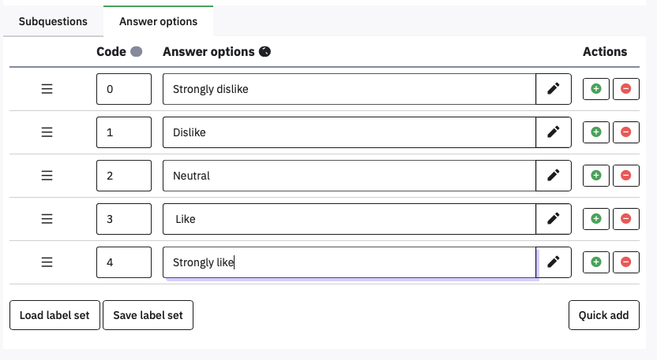
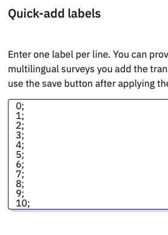
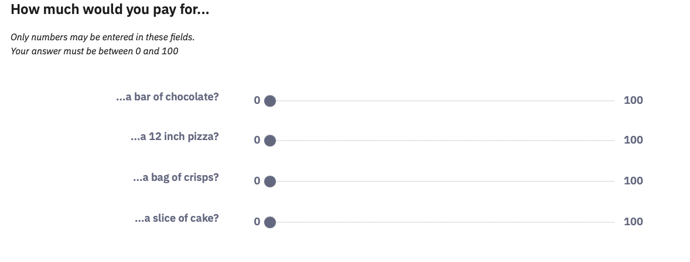

# A matrix of items using a Likert scale
## Likert Rating Scales

Most questionnaires will use some form of rating scale, where people
have to select one of several ordinal responses. Common examples are
Likert-type scales, such as:

Strongly Disagree – Disagree – Neither – Agree – Strongly Agree

Not at all like me – somewhat like me – very like me

0 (not at all) – 1 – 2 – 3 – 4 – 5 – 6 – 7 – 8 – 9 – 10 (Constantly)

These can be thought of as horizontal single choice questions, and there
are a variety of **Array question** types for them, but the basic
**Array** is suitable for most cases.

**Add a question**, and select the **Array** question type. Name the
question **Foods**, set the **Question** to ‘How much do you like…’ and
use **Quick add** to create (and name) five subquestions.

Did you remember to avoid a space between the code, semicolon, and
Subquestion text? If you didn’t, please edit the spaces out before
proceeding.

Whenever you have several consecutive items using the same answer scale
then they can be presented as a matrix to make them easier to answer and
use less screen space.

Click Answer options to define a 5 point Likert response scale, with the
Codes 0 to 4 (you can use Quick add).

Using numbers for the codes here can make scoring the data easier later.
Once again, make sure there are no spaces after the numbers or before
the Answer options. Save and preview!

If you are writing a lot of surveys, you can save a frequently used
scale like this by clicking Save label set. You can then reload it later
using Load label set.

## Semantic Differential questions

Semantic differential questions are those where you put an adjective on
the left and its opposite on the right, and so rate the same statement
on several dimensions.

In Limesurvey this is just an Array, but you put the left and right
labels in the Subquestion text, separated by the vertical bar character
| . The | might take you some time to locate on your keyboard, but it
should be there.

For the answer options, on separate lines type the values 0 to 10
(for the Codes) followed by a semicolon, and nothing else.

You should end up with an unlabelled semantic differential like this:

The alignment of the left hand side is not great; it needs to be
right-aligned. We can fix this by adding HTML tags to the subquestion
text.

## Continuous Sliders

An alternative to discrete ordinal Likert scales, sliders provide a continuous rating between two values, a bit like the ‘visual analogue scales’ used in physical questionnaires. These are hidden away under the **Mask question** type **Multiple numerical input.**

Create a **Multiple numerical input** question called **Slider**, with
the **question** ‘How much would you pay for…’ and the **Subquestion**
‘…a bar of chocolate?’

To make it a slider, open the bottom option on the right hand menu,
**Slider**. Set **Use slider layout** to On. Set the **minimum** value
to 0, the **maximum** to 100, and the **accuracy** to 1. Turn On the
**Display slider min and max value.**

 s

You can now add more items as different subquestions

## Duplicating questions

Often your surveys will consist of lots of similar questions. You can
save time by getting one question exactly the way you want it, and then
duplicating it, so all you have to do is edit the content.

For example, the Slider question had a lot of settings which would take
time to replicate. If you wanted to ask a slightly different question
using a slider, you could replicate it and just change the question
text.

Hover over the Slider question and click the **three dots** that appear
to the right, and select **Copy** to duplicate it.

Notice that you have options about what to copy over. Leave them all as
**Yes**, and click **Save and close**. Edit the SliderCopy question and
change the question to ‘How long would it take you to eat...’.

