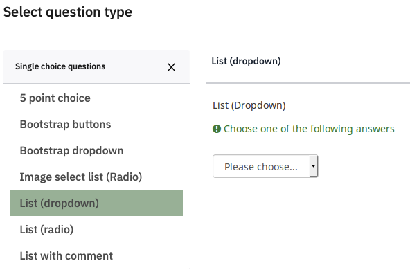
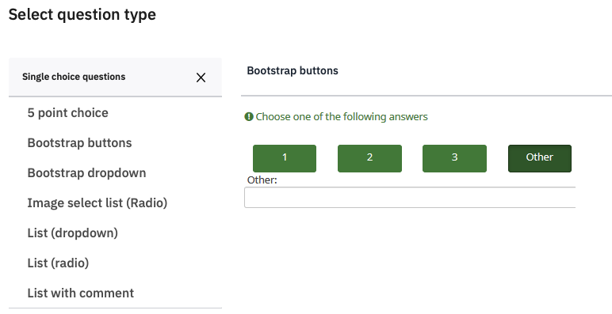
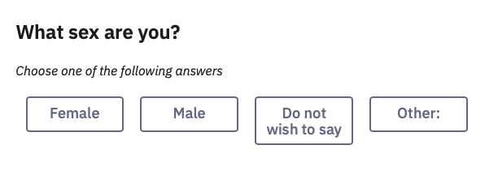
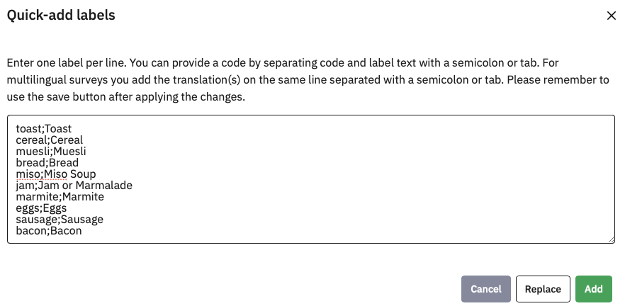
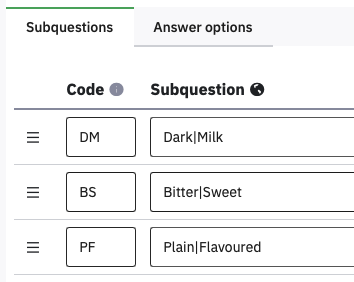
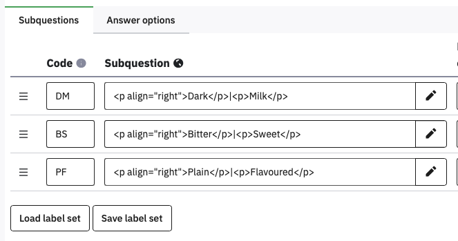
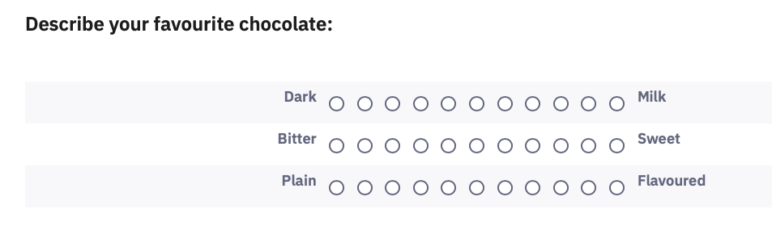
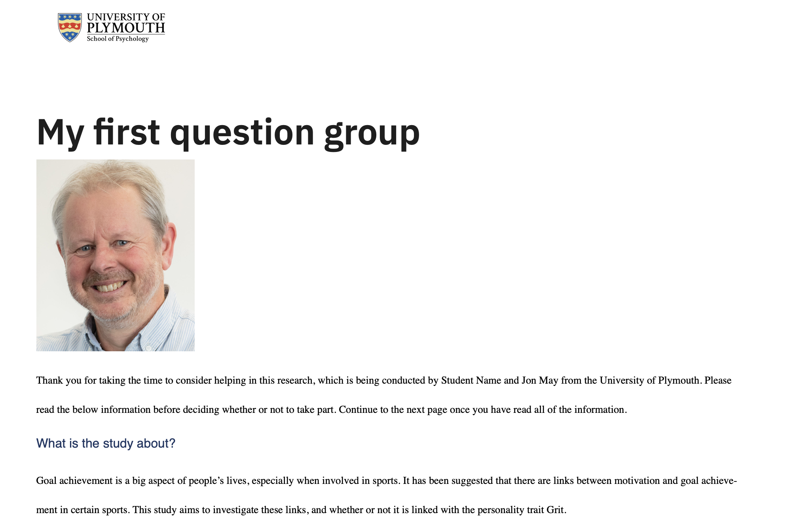
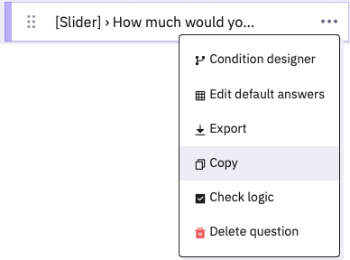
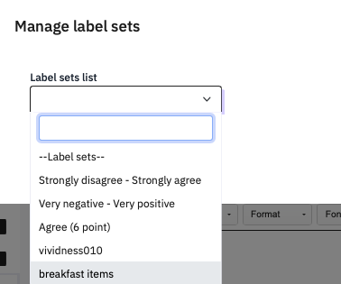

# Other types of questions
## Dropdown lists

A dropdown list is an alternative way of presenting answer options that
can be useful when you have a lot of options that would otherwise take
up a lot of screen space. They have a disadvantage, in that the
participant has to click and drag to the right answer rather than just
click, so some people find them harder to use.
*Avoid dropdown lists if space is not an issue.*

Change Sex into a dropdown list by editing it and changing the Question
type from **List (radio)** to **List (dropdown).**

 s

## Buttons

A third way to present items is as a row of buttons. Change Sex to
Bootstrap buttons, click Save, and the preview question:

As you can see, the longer answer looks a bit ugly, so take care with
this style.

## Multiple Answer Questions

Single answer lists have round ‘radio buttons’ that toggle on and then
off if people press another one. If you ask people whether they had
cornflakes or toast for breakfast, and they had both, they may be
frustrated with your survey.

Make a new group ‘Questions’, set its Condition to Consent=="Y" and
click Save.

Add a new question Breakfast which asks ‘What did you have for
breakfast’, and under Question Type click **Multiple choice questions,**
and select **Multiple Choice**.

We will add several items that you might have for breakfast. Instead of
adding them one at a time, click **Quick add**. Then add some things
they might have had.

As the help information says, here we are naming the option as well as
entering the text to display, separating them with a semicolon (no
spaces). When you click **Add**, they will all be filled in for you.

Notice that we still have the example row though – Add will Add to the
existing options. If you had clicked **Replace**, it would have replaced
them. You can remove the example by clicking

Click Save and preview the
question.

This format uses checkboxes which show ticks if selected:

{width=50%}

Ten items take up a lot of space, so you could format them in columns –
under Display, set Display columns to 3. Save and preview!

Radio buttons and checkboxes are universally used conventions in
computer interface design, so you should not need to add explanatory
text.

From a data point of view, each option becomes a separate yes/no
question, so the data file becomes correspondingly larger, *and you
should use these sparingly.*

## Likert Rating Scales

Most questionnaires will use some form of rating scale, where people
have to select one of several ordinal responses. Common examples are
Likert-type scales, such as:

Strongly Disagree – Disagree – Neither – Agree – Strongly Agree

Not at all like me – somewhat like me – very like me

0 (not at all) – 1 – 2 – 3 – 4 – 5 – 6 – 7 – 8 – 9 – 10 (Constantly)

These can be thought of as horizontal single choice questions, and there
are a variety of **Array question** types for them, but the basic
**Array** is suitable for most cases.

**Add a question**, and select the **Array** question type. Name the
question **Foods**, set the **Question** to ‘How much do you like…’ and
use **Quick add** to create (and name) five subquestions.

Did you remember to avoid a space between the code, semicolon, and
Subquestion text? If you didn’t, please edit the spaces out before
proceeding.

Whenever you have several consecutive items using the same answer scale
then they can be presented as a matrix to make them easier to answer and
use less screen space.

Click Answer options to define a 5 point Likert response scale, with the
Codes 0 to 4 (you can use Quick add).

Using numbers for the codes here can make scoring the data easier later.
Once again, make sure there are no spaces after the numbers or before
the Answer options. Save and preview!

If you are writing a lot of surveys, you can save a frequently used
scale like this by clicking Save label set. You can then reload it later
using Load label set.

## Semantic Differential questions

Semantic differential questions are those where you put an adjective on
the left and its opposite on the right, and so rate the same statement
on several dimensions.

In Limesurvey this is just an Array, but you put the left and right
labels in the Subquestion text, separated by the vertical bar character
| . The | might take you some time to locate on your keyboard, but it
should be there.

For the answer options, on separate lines type the values 0 to 10
(for the Codes) followed by a semicolon, and nothing else.

You should end up with an unlabelled semantic differential like this:

The alignment of the left hand side is not great; it needs to be
right-aligned. We can fix this by adding HTML tags to the subquestion
text.

## Continuous Sliders

An alternative to discrete ordinal Likert scales, sliders provide a continuous rating between two values, a bit like the ‘visual analogue scales’ used in physical questionnaires. These are hidden away under the **Mask question** type **Multiple numerical input.**

Create a **Multiple numerical input** question called **Slider**, with
the **question** ‘How much would you pay for…’ and the **Subquestion**
‘…a bar of chocolate?’

To make it a slider, open the bottom option on the right hand menu,
**Slider**. Set **Use slider layout** to On. Set the **minimum** value
to 0, the **maximum** to 100, and the **accuracy** to 1. Turn On the
**Display slider min and max value.**

 s

You can now add more items as different subquestions

 
## Adding Images or Movies
If you ever need to add an image or movie to a question (or to Text)
then there are three buttons on the toolbar that allow you to do this.
They either need to be stored elsewhere on the internet (so you can
provide a URL) or you can upload them to psyserver. For example, adding
a simple image can be done by clicking the
 button. In the dialog that
appears, click **Browse Server** to get the
 option and find a file on
your computer to upload:

{width=50%}

{width=50%}

To select the image you have uploaded, double-click it. Depending on its
size, it might not all show in the preview box of the Image dialog, so
you can enter a sensible display width or height (the other will be
calculated):

{width=50%}

When you have added a picture to the top of your Information Text,
click the green **Save** button and then
**preview** **question**.

You can also add images, and I suppose videos, to the text for Questions, Subquestions and Answer options, using the pencil icon at the right of the space for entering text to open the HTML editor. 

## Duplicating questions

Often your surveys will consist of lots of similar questions. You can
save time by getting one question exactly the way you want it, and then
duplicating it, so all you have to do is edit the content.

For example, the Slider question had a lot of settings which would take
time to replicate. If you wanted to ask a slightly different question
using a slider, you could replicate it and just change the question
text.

Hover over the Slider question and click the **three dots** that appear
to the right, and select **Copy** to duplicate it.

Notice that you have options about what to copy over. Leave them all as
**Yes**, and click **Save and close**. Edit the SliderCopy question and
change the question to ‘How long would it take you to eat...’.

## Saving lists of subquestions and answer options for reuse
Make a copy of Breakfast, name it Favourite, and turn it into a Single
choice question **List (radio)**. Oh no, all the sub-questions have
vanished! Save and close.

Return to Breakfast and **Edit** it. Click **Save Label set** underneath
the subquestions – choose **New label set** and name it breakfast items.

Return to Favourite, and click **Load label set**, then select breakfast
items (the example here shows other label sets I’ve saved previously.

The Answer options should be filled with the list you had saved. Save
and preview.

