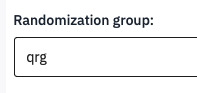
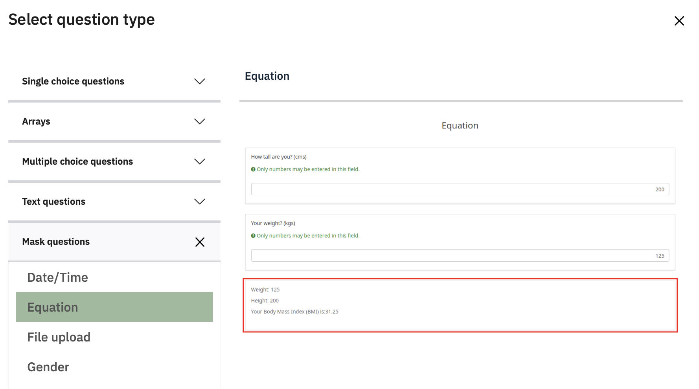
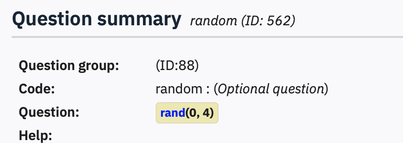
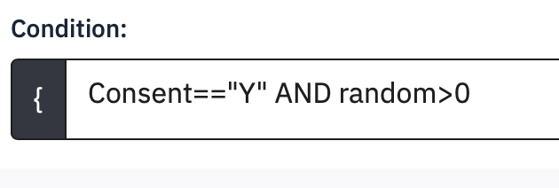
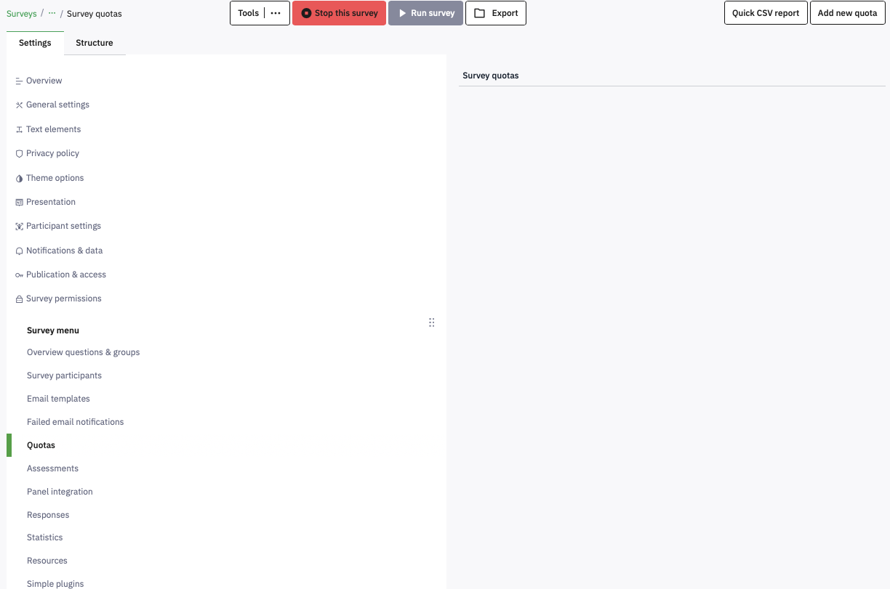
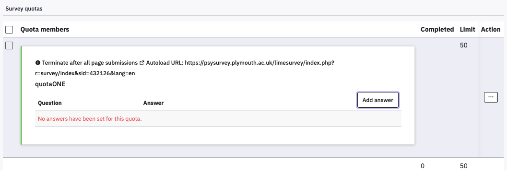
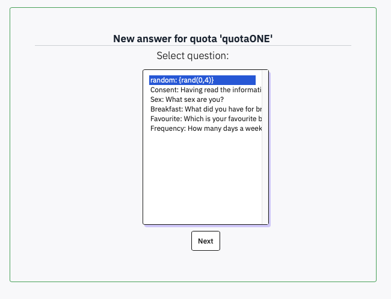
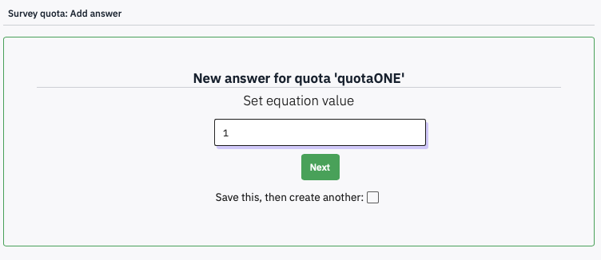

# Randomising items, questions and blocks

If you have several questions each with a number of nominal options and
always present everything in the same order, then there may be some
systematic bias in the way they are answered. As the survey goes on,
perhaps people get riskier, or more conservative, or more prone to
choose the middle option.

It is therefore good practice to randomise the order of options within
questions (provided that they are not ordinal, of course) and to
randomise the order of questions (so long as they do not follow on from
each other).

## Randomising items in a question

Consider the Breakfast multiple-answer question, which has lots of items
that people might have eaten for breakfast. If people read through this
in order, they might all tend to pick the first thing they come across
that they ate, and ignore later possible matches.

To turn on within-question randomisation, **Edit** the question and
click **Display**. Set **Random** **order** to Yes.

While you are here, you could also hide the italic help text that is
appearing in every question, by setting **Hide tip** to On.

In the Foods question, you have also created a matrix of items rated on
a Likert scale. These could also appear in random order.

Randomise the order of the Foods items within the Likert-scale question,
and Hide tip. Do the same for Chocolate, and the two Sliders.

## Randomising the order of questions

To randomise the order of questions, they need to be in the same group,
and associated within a Randomization group.

Edit Breakfast, and in the **Logic** section, set **Randomization group
name** to **rg1**. Then do the same for Foods, Chocolate and Slider, but
not SliderCopy. rg1 is just an arbitrary name – you can use anything.

Each person who responds to your survey will now see a different
presentation of the first four questions, but the ‘How long would it
take you to eat…’ questions will always come last.

If you ‘Preview’ the survey a few times, then you should see this
working. You might have to preview the whole survey, not just the group.

Even when people do question in a different order, and the items are
also in a different order, when you download the data, all the responses
and questions will be in the same order that you have listed them in the
survey.

## Randomising blocks

If you have several blocks, then these can also be presented in random
order.

Edit the Demographics group and set its Randomisation group to **qrg
(**an arbitrary name, again). Do the same for Questions.

When you preview your survey now, you’ll find that it is a right jumble.

## Randomise participants into conditions

Sometimes you might want to randomly allocate people to one of two sets
of questions, or have a third in each of three conditions. This can be
useful if you want to compare different ways of framing questions, or
ask about different topics.

To do this you need to create a random number (e.g., 0 or 1, or 1,2, or
3), and then make the Group condition match one of the values.

One of the Question types is an Equation, which can be used to generate
random numbers.

Create a new question called random and set its question type to **Mask
question - Equation**

In the **Question** type {rand(0,4)}. The curly brackets tell limesurvey
that this is computer code to be evaluated, and rand(x,y) is a function
that generates integers in the range x to y inclusive. Our question will
therefore create the numbers 0, 1, 2, 3 or 4. To stop this question
appearing in the survey, set **Display** – **Always hide this question**
to On. Save and close. In the question summary,

In **Structure**, move **random** to be
the very first question in the survey. In the question summary, you
should see the rand function in blue, to confirm that it has been
recognised by limesurvey. If you hover over it, you will see an
explanation of what it does.

{width=50%}

Now set a different **Condition** for each of the
first four questions in **Questions**. Set
**breakfast’s** condition to be random==1,
**foods** to random==2, **chocolate** to
random==3, and **Slider** to random==4. You do not need the
brackets now because they are automatically added to the left and right
of the Condition.
When you **Preview survey** a few times, you will see
just one of these questions and **SliderCopy**. Sometimes,
when random is 0, you’ll only see SliderCopy.

{width=50%}

Although this example has randomly chosen one question, you can also set
a Group conditions to match one of the random values. If you edit the
**Condition** of Questions to Consent=="Y" AND random>0 then when
random is 0 none of the questions in this block will be shown.

{width=50%}

## Using Quotas to allocate people to conditions

Using the Random allocation method described above is a **bottom up** method that
will lead to roughly equal proportions of people starting each condition.  
You can achieve uneven allocations (e.g., 1/3 and 2/3) by choosing your random numbers and conditions carefully
(e.g., random=rand(1,3) then the conditions random=1 and random >1).

If you need more precise **top down** control over the number of people finishing a condition, then you need to use Quotas. 

First, make a copy of your survey's URL from the **Overview - Share survey** panel (it is green and starts https://psysurvey.plymouth.ac.uk/)

In your survey's **Settings**, from the **Survey menu** select **Quotas**, and then click **Add New Quota** at the top right.

{width=75%}

Paste your survey URL into the **URL box**, then set the **Quota name**, and put the number of responses you want in the **Limit** box.
Set the **Quota Action** to 'Terminate after related visible and hidden questions were submitted'.
Set **AutoloadURL** to Yes.

{width=75%}

In the next three windows, click **Add answer**, then select your random variable, and then the value you want the quota to apply to. If you are setting quotas for several values, check the 'create another' checkbox. Click **Next**.

{width=75%}

{width=50%}
{width=50%}

The effect of this will be to check how many people have completed the survey with random set to each value, and if the limit has been met, to reload the survey - and hence generate a new random number to fulfill a different quota. As the quota action is to rerun the survey automatically, the Quota message will not be displayed. If all of the quotas are full, though, the survey will get stuck so you need to make sure you deactivate it once you have all of the people you need.

For this to work smoothly, you need to have turned off the Welcome message in **Settings - Presentation**, so that it keeps reloading, to have the hidden random question as the first question in its own group, and to be displaying items question by question, or by group, as the quota is only checked when the random question is submitted.

