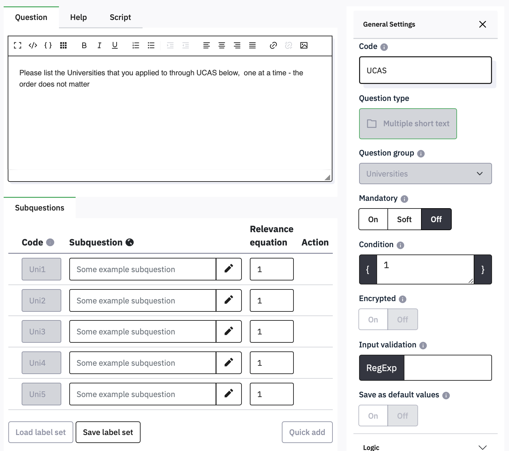

# Using answers from one question in a later question

You might want to include one answer in a subsequent question, e.g.,
after asking ‘What do you crave most’, and having them choose
‘chocolate’, you might want to ask ‘How often to you crave chocolate?’.
You don’t want to write a different question for every option in the
first question, but to replace chocolate with whatever they answered.

This is called Piping.

For example, if you have created the Favourite question which asked people what their Favourite food is, you might then want to ask how often they eat it.

## Piping a List question answer

Insert a new **Single choice question** named Frequency, and make it a
**List (radio)**

Make the text ‘How many days a week do you eat {Favourite.shown}’ and
set **Hide tip** to On. Save and close, then preview the Group. Make sure to use the special
curly braces, on the right side of the keyboard (Shift-square bracket).

Before you click an option in Favourite, the Frequency question is just
‘How often do you eat?’. As soon as you select an option, that answer is
pasted in. If you change your selection, the Frequency question updates
too.

When you are using piping, make sure that every possible answer works
grammatically. Problems can be caused by options that vary in number, or
questions that have ‘a’ or ‘an’ before the piped text, e.g. *What are
you most afraid of, **spiders** or an **elephant**?* followed by ‘*What
would you do if you saw a [piped text]*’

Putting the name of a question followed by ‘.shown’ in curly brackets as
in the List question example will generally work, unless there are
multiple questions for an answer, as in an Array or Multiple Choice
question.

## Piping answers from a multiple choice or array question

Where there is more than one aswer for a question, you need to include
the name of the subquestion in the piping, e.g., {Breakfast_toast.shown}
– notice that the question and subquestion are separated by an
underscore (not a dash - ! Underscore is typed using Shift-dash).

Try adding a question called Chosen as a **Long Free Text** item, with all ten of the breakfast items on separate lines, and move it immediately after the Breakfast question.

 

If you preview the group, then you will see the item text of all checked
items appear in the list as soon as you select them. If they are
unselected, there isn’t even a blank line.

## Piping answers from one question into another

Previous answers can be included in lots of other places, such as
subquestions, answer options and conditions. For example, this question
lets people list five Universities and records them in the fields Uni1
to Uni5

The question looks like this in the survey:

You can then use these answers anywhere else in your survey, for
example, in the conditions for a later question:

The condition !is_empty(UCAS_Uni1) means ‘if UCAS_Uni1 is not empty’, so
this question would only be shown if the box for Uni1 had been filled
in. This avoids the question ‘Did you visit at any of the following’
being displayed when Uni1 is left empty.

For the official documentation on all of the [functions](https://www.limesurvey.org/manual/Expression_Manager#Implemented_Functions), [operators](https://www.limesurvey.org/manual/Expression_Manager#Operators), and how to refer to [questions](https://www.limesurvey.org/manual/Expression_Manager#Access_to_Variables) and their attributes, there is detailed help  in the [Limesurvey manual](https://www.limesurvey.org/manual). 

