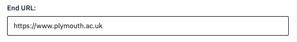
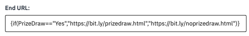
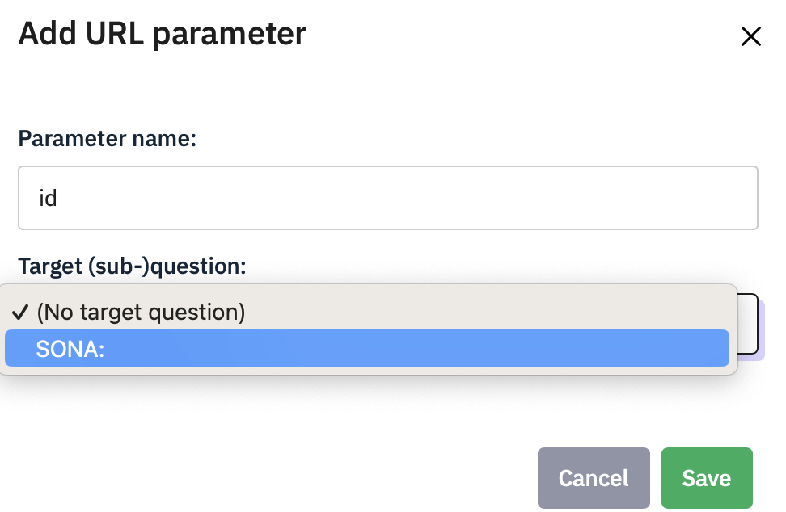

# Redirect to another website or SONA

When a participant has finished your survey, you may want them to do
something else, or grant them participation credit by returning to SONA.

If you want them to do an experiment, you might want to send them to a
URL for your study, on JATOS.

Depending on the answers they have given to a question you might want to
send them to different places, for example, if you have a prize draw you
might have a question that asks if they want to be entered, and then
send them to a separate survey to collect an email address (you should
NEVER collect such personal data in your main survey). Another
possibility might be that they failed an attention check, so you do not
want to give them participation points.

Wherever you want them to go, the destination is set in the **Settings
\> Text Elements** option, in the **End URL** field. For example, this
will send them to the University of Plymouth home page at the end of the
survey (not very useful).



## Conditional redirecting

Suppose you have a prize draw entry question and want to send them to a
url <http://bit.ly/prizedraw.html> if they say "Yes" but to
<http://bit.ly/noprizedraw.html> if they say "No".

In **Settings \> Text Elements**, find the **End URL** field, and enter
an {if(variable==value,then-do-this, else-do-this)} statement, e.g.,



You can make complicated conditions by nesting if() statements in the
then-do-this or else-do-this parts of the main if().

## Using Limesurvey with SONA

If you are using the SONA participant pool, then every person who signs
up to do your survey is given a unique participant ID number. You can
send this to Limesurvey, then get Limesurvey to send the ID back to SONA
at the end of the survey so that SONA can grant credits.

On SONA, change the Study URL so it includes &id=%SURVEY_CODE% in the
URL. So if the LimeSurvey URL is:

```         
https://psysurvey.plymouth.ac.uk/index.php?r=survey/index&sid=/651365&/lang-en
```

then change it to

```         
https://psysurvey.plymouth.ac.uk/index.php?r=survey/index&sid=/651365&/lang-en
&id=%SURVEY_CODE%
```

**About URLS:** when you put a ? at the end of a URL, everything that
follows is a sequence of parameter names and values which the receiving
web page can use. In this case, we are just sending one parameter,
called id, and it takes the value %SURVEY_CODE% - this is actually
replaced by SONA with the participant’s unique participant ID.

The Study Information on SONA now also displays a URL labeled
"LimeSurvey End URL".

In LimeSurvey, configure the survey to accept the id number, as URL
Parameter named id. To do this, go to **Settings \> Survey menu \> Panel
Integration** and click **Add URL parameter** . name it **id** and leave
the target question unspecified. Remember to use lower-case as this is
case-sensitive.


To return the information to SONA, you need to add an End URL. This is
the ‘Limesurvey End URL’ value shown in SONA. It will be something like
this one:

```         
https://uopsop.sona-systems.com/
webstudy_credit.aspx?experiment_id=123&credit_token=4e48f9b638a&
survey_code={PASSTHRU:id}
```

Copy it, go back to Limesurvey’s **Settings \> Text Elements**, find the
**End URL** field, and paste.


There is a problem here though – people who do not consent will also
receive credit. To fix this we need to turn this into some evaluated
code with a condition:

```         
{if(Consent=="N", "https://uopsop.sona-systems.com/",
"https://uopsop.sona-systems.com/
webstudy_credit.aspx?experiment_id=123&credit_token=4e48f9b638a&
survey_code={PASSTHRU:id}")}
```

This is a bunch to type, but you can just use this example and carefully
paste your own experiment_id and credit_token values into it.

If you try to do this in Word, beware Word’s helpful smart quotes
feature which will turn the straight quotes into curved ones, which will
not work in Limesurvey.

### Recording the SONA id in your data

You should not normally need to record the SONA id in your data file, as
doing so is potentially a security risk allowing you or others to look
up the personal details of a respondent if they have access to SONA.
However, if you are chaining together several surveys or experiments and
you need to be able to link the data from the different output files,
then recording the SONA id is the least worst way to do this.

To save the id in your data file you need to create a hidden question in
your survey and link the parameter to it.

For example, you could create a short/long free text question called
SONA in the **Question code** field, and from the Display menu enable
**always hide this question**. Move this question to the start of the
survey so that is the very first question, even before the Information
text question. You will need to make sure you have turned off the
Welcome screen too (you should always do this) in **Settings \>
Presentation**.

In the Panel Integration dialog, select SONA from the **Target
question** dropdown. Participants coming from SONA will land on this
question, but they will not see it, as it is hidden. Their id code will
be saved as the 'answer' to the SONA text question.

{width="244"}

## Using Limesurvey with JATOS and OpenSesame

Sending a participant to JATOS instead of SONA is done in the same way,
except that you will paste in the URL for your experiment on JATOS
instead.

You can pass the participant id using the `?id={PASSTHRU:id}` option.

In your OpenSesame experiment, you need to have added inline javascript
as the first event to receive the parameters and copy them into JATOS
variables, so that they are saved in the data file:

```         
try{vars.participant_URL_ID =
jatos.urlQueryParameters.id}catch(e){vars.participant_URL_ID =0}
```

At the end of your experiment, you need to send the code back to SONA
(or to another survey), e.g.

```         
try{jatos.endStudyAndRedirect("https://uopsop.sona-systems.com/
webstudy_credit.aspx?experiment_id=4221&
credit_token=84720f17f1724a69b9c23b1a1ae945d9&survey_code=" +
vars.participant_URL_ID);}catch(e){}
```

If you are able to write OpenSesame experiments and use the JATOS
server, then you can probably work out how to do this, so I am just
including the info here to let you know that it is possible and it does
work.
