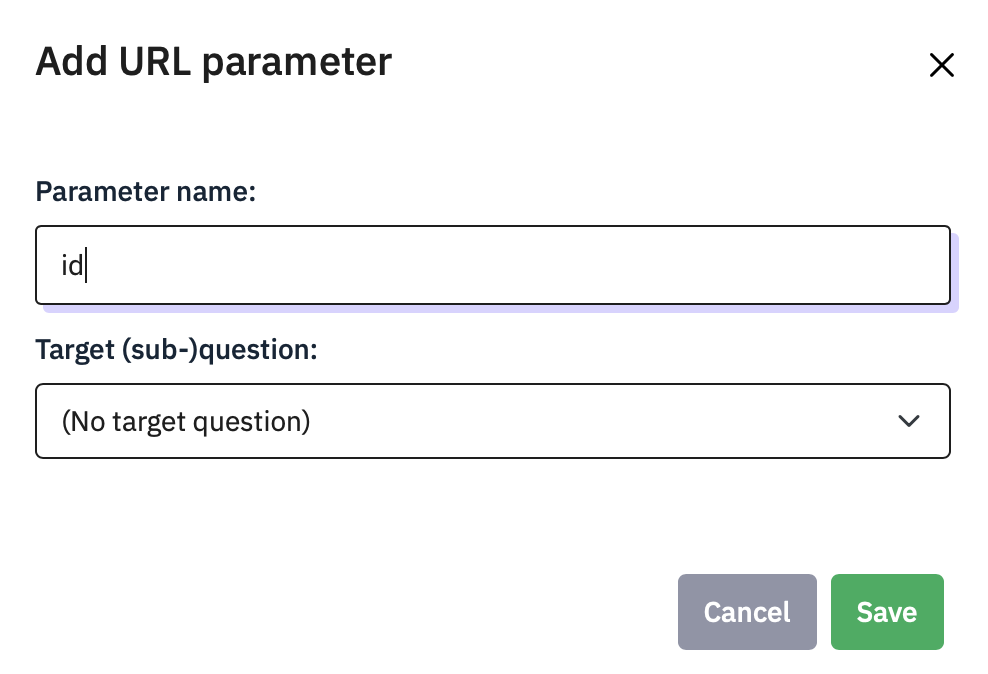

# Redirect to another website or SONA

When a participant has finished your survey, you may want them to do
something else, or grant them participation credit by returning to SONA.

If you want them to do an experiment, you might want to send them to a
URL for your study, on JATOS.

##  Using Limesurvey with SONA

If you are using the SONA participant pool, then every person who signs
up to do your survey is given a unique participant ID number. You can
send this to Limesurvey, then get Limesurvey to send the ID back to SONA
at the end of the survey so that SONA can grant credits.

On SONA, change the Study URL so it includes &id=%SURVEY_CODE% in the
URL. So if the LimeSurvey URL is:
```
https://psysurvey.plymouth.ac.uk/index.php?r=survey/index&sid=/651365&/lang-en
```
then change it to
```
https://psysurvey.plymouth.ac.uk/index.php?r=survey/index&sid=/651365&/lang-en
&id=%SURVEY_CODE%
```

**About URLS:** when you put a ? at the end of a URL, everything that
follows is a sequence of parameter names and values which the receiving
web page can use. In this case, we are just sending one parameter,
called id, and it takes the value %SURVEY_CODE% - this is actually
replaced by SONA with the participant’s unique participant ID.

The Study Information on SONA now also displays a URL labeled
"LimeSurvey End URL".

In LimeSurvey, configure the survey to accept the id number, as URL
Parameter named id. To do this, go to **Settings > Survey menu > Panel
Integration** and click **Add URL parameter** . name it **id** and leave
the target question unspecified. Remember to use lower-case as this is
case-sensitive.




To return the information to SONA, you need to add an End URL. This is
the ‘Limesurvey End URL’ value shown in SONA. It will be something like
this one:
```
https://uopsop.sona`-systems.com/
webstudy_credit.aspx?experiment_id=123&credit_token=4e48f9b638a&
survey_code={PASSTHRU:id}
```

Copy it, go back to Limesurvey’s **Settings > Text Elements**, find the
**End URL** field, and paste.


There is a problem here though – people who do not consent will also
receive credit. To fix this we need to turn this into some evaluated
code with a condition:
```
{if(Consent=="N", "https://uopsop.sona-systems.com/",
"https://uopsop.sona-systems.com/
webstudy_credit.aspx?experiment_id=123&credit_token=4e48f9b638a&
survey_code={PASSTHRU:id}")}
```
This is a bunch to type, but if you just paste

```
{if(Consent=="N", "https://uopsop.sona-systems.com/", "
```
onto the front, and
```
")}
```
onto the end it is done. If you try to do this in Word, beware
Word’s helpful smart quotes feature which will turn the straight quotes
into curved ones, which will not work in Limesurvey.


## Using Limesurvey with JATOS and OpenSesame

Sending a participant to JATOS instead of SONA is done in the same way,
except that you will paste in the URL for your experiment on JATOS
instead.

You can pass the participant id using the `?id={PASSTHRU:id}` option.

In your OpenSesame experiment, you need to have added inline javascript
as the first event to receive the parameters and copy them into JATOS
variables, so that they are saved in the data file:
```
try{vars.participant_URL_ID =
jatos.urlQueryParameters.id}catch(e){vars.participant_URL_ID =0}
```

At the end of your experiment, you need to send the code back to SONA
(or to another survey), e.g.
```
try{jatos.endStudyAndRedirect("https://uopsop.sona-systems.com/
webstudy_credit.aspx?experiment_id=4221&
credit_token=84720f17f1724a69b9c23b1a1ae945d9&survey_code=" +
vars.participant_URL_ID);}catch(e){}
```
If you are able to write OpenSesame experiments and use the JATOS
server, then you can probably work out how to do this, so I am just
including the info here to let you know that it is possible and it does
work.


