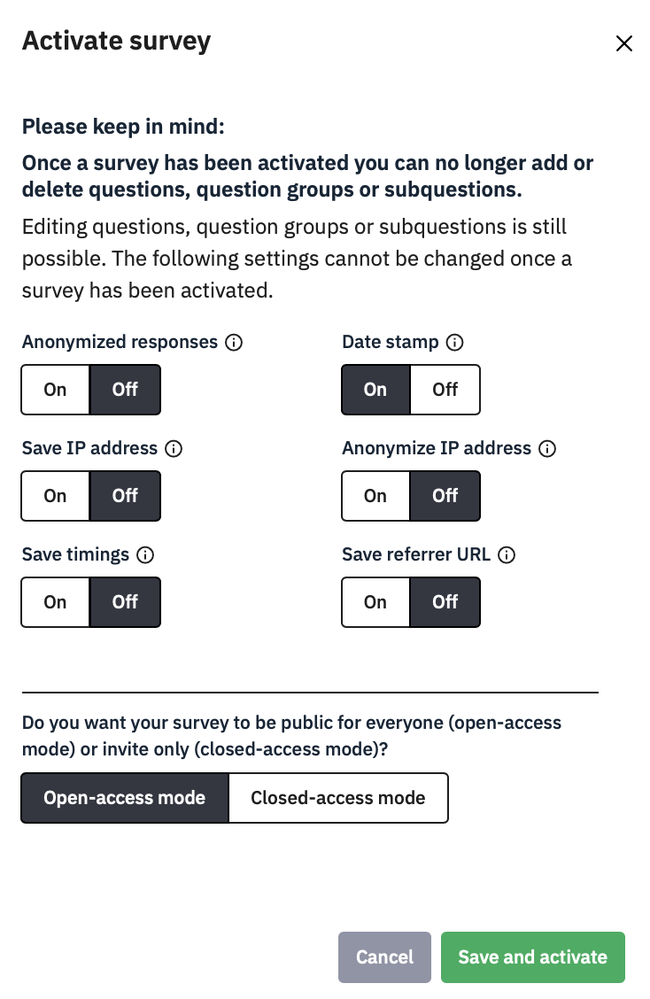
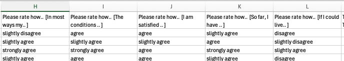
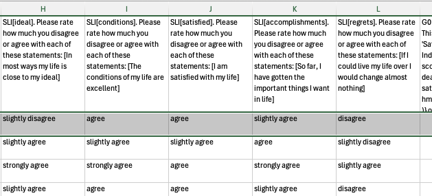
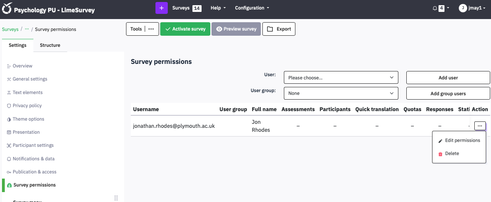
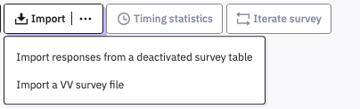

# Running your survey

Previewing the survey does not collect data (that annoying yellow bar
has told you that).

It is safe to activate your survey while you are developing it. Click
the green Activate survey button to do so.


Despite the scary warnings in the next pop up, you can add and delete
things, if you deactivate the survey again, though this will delete any
data you’ve collected in the meantime so you should not actually collect
real data until you have thoroughly pilot tested the survey and checked
its data file. Check that **Date stamp** is On, so you can work out when
each participant did the survey. Leave the rest Off. You do want
**Open-access mode** unless you are using a Limesurvey Panel to invite
people from a mailing list you have set up (not in this guide).

{width="50%"}

## Downloading data

You can download your data at any time from the **Settings – Survey
menu** option **Responses.**

Clicking this brings up a screen with information about how many
responses you have and some options to display them on-screen. However,
you simply need to click the **Export** button at the top of the screen,
and choose Export responses.


After that the flexibility makes it look complicated, but if you leave
everything at their defaults you will get a plain CSV file that anything
can read. The main choice you need to make is on the right, under
**Headings : Export questions as**:

Here is an example of how a survey’s data exports with each option:

Question Code:


Abbreviated question text:



Full question text:


Question code and question text:



The last option, **Question code and question text**, is the best from
an Open-Science point of view, especially if you leave **Export
responses** as Full answers, as I have here.

This data file is fully comprehensible in its own right, without needing
a copy of the survey to consult to understand what was asked or what the
answers mean. For analytic purposes, the header row cells start with the
Question name, the subquestion code in brackets, followed by the
Question text, and then the subquestion text in brackets.

It is possible to split this text up in a program like R to keep the
codes as variable names (e.g., MTF_01 and MTF_02 while preserving the
question and subquestion text as a vector for labelling output.

For example, here is some R code to do this:

```         
data<-read.csv("results-survey352368.csv") # read the limesurvey data

var.item<-tibble(cols=colnames(data)) %>% # make a tibble from data's columnames
  mutate(cols=str_replace_all(cols,"[","_"), # replace [ with _
         cols=str_replace_all(cols,"]",""), # delete ]
         var=str_extract(cols, "[A-Za-z0-9_]*."), # select all text up to first dot
         var=str_sub(var, 1, -2), # delete the dot
         item=str_sub(cols, str_length(var)+3,-1)) # select everything after the dot

colnames(data)=var.item$var # set columnames in data to var
```

It is also advisable to export the **full answer text**, rather than
Answer codes. Answer Codes turns the data into whatever you had entered
in the Codes field of the question or numerical values if you had left
them blank, as here:


Answer codes look easy to analyse, but what do they mean? Which ones
need to be reverse coded? Text is meaningful, so export it and make the
effort to recode it to numbers in your analysis script. Putting the data
and script together makes your research transparent, and mistakes can be
spotted and corrected.

For example, this R code finds all items beginning MTF, recodes their
likert scale to numbers, reverse codes some items, and finds the mean
for each participant:

```         
mtf<-data %>% select(participant, starts_with("MTF")) %>% # select ID and MTF vars
  pivot_longer(-participant) %>% # make longer (participant, name, value)
  mutate(rating=case_when( # create a new variable called rating
                 value=="Strongly agree" ~ 5, # matching each text to a number
                 value=="Agree" ~ 4,
                 value=="Neither agree nor disagree" ~ 3
                 value=="Disagree" ~ 2,
                 value=="Strongly disagree" ~ 1,
                 T ~ NA), # anything else is NA
      rating = ifelse(name %in% c("MTF_01", "MTF_03", "MTF_09"), # if the name is in this list
                      6-rating, # reverse-code the item
                      rating) # else leave it alone
      ) %>%
  group_by(participant) %>% # for each ID
  summarise(mtf=mean(rating, na.rm=T)) # find mean rating, removing NA
```

## Sharing your survey with colleagues

If you are working in a group you might want other Limesurvey users to
be able to view or edit your survey or access the data. You can add
users to a survey from the **Settings** menu, under **Survey
Permissions**. Select a User from the **User: Please choose…'** dropdown
list, and click **Add User**.



You then need to grant them 'permissions' by clicking the ... icon at
the right of their row in the list of users and select **Edit
permissions**. Set them like this by checking the **General** box on a
row (the others are then filled in for you)

{width="50%"}

There is also an option to add a whole Group of users, but we advise
against doing this because you can only remove people one at a time and
the edit permissions screen is currently buggy.

## Stopping your survey

When you have finished piloting your survey and need to make changes, or
when you have run it properly and finished collecting data, you can Stop
the survey to prevent any more responses being made. When it is running
the green Activate Survey becomes a red button:


Clicking this brings up a choice:


If you have indeed finished collecting data, then the left hand **Expire
Survey** is a sensible option to make. Your data is easy to access, but
you cannot make many changes to the survey.

If you have just finished piloting and not yet run the survey, then you
want to take the right-hand option, to **Deactivate survey** – but this
will make the data harder to find (it is not deleted). Choose this one
if you have been piloting to collect test data, and you have already
exported the fully labelled Question code & question text version with
Full answers.

If you do deactivate, then you’ll see this:


Do save a screen shot of this and name it sensibly, in case you do want
to find that data. All those numbers are a code for the survey, and then
a date and timestamp.

To load it up again, **Activate the survey**, go to **Responses**, and
click **Import**. **Choose Import responses from a deactivated survey
table**.



I’ve tried this and it works – if there is more than one old dataset
then you can choose which you want to reload. Note the warnings though –
only some editing changes to the survey can be managed. If you’ve made
other changes, the data may be lost or mangled.


